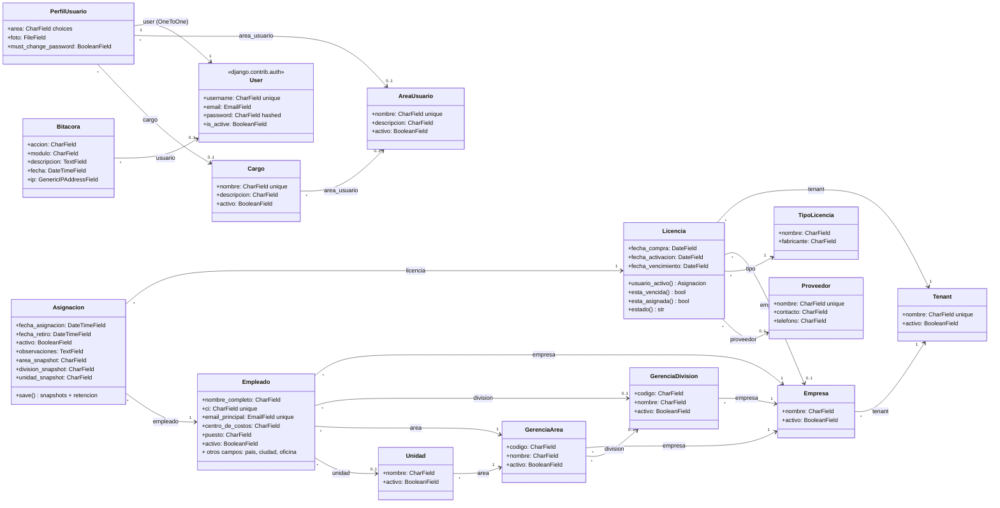

# Diagrama de clases — Proyecto Mamaya Licencias

Este documento contiene el diagrama UML de clases del modelo de datos completo del proyecto.

## Modelos cubiertos

| App | Archivo físico | Modelos |
|---|---|---|
| **licencias** | `licencias/models.py` | `Tenant`, `Empresa`, `Proveedor`, `TipoLicencia`, `Licencia`, `Asignacion` |
| **empleados** | `empleados/models.py` | `GerenciaDivision`, `GerenciaArea`, `Unidad`, `Cargo`, `Empleado` |
| **user** | `user/infrastructure/models.py` | `AreaUsuario`, `PerfilUsuario` |
| **bitacora** | `bitacora/infrastructure/models.py` | `Bitacora` |
| **gestion_global** | `gestion_global/infrastructure/models.py` | *(sin modelos propios — re-exporta `Empresa`, `Tenant`, `GerenciaArea`, `GerenciaDivision`, `Unidad` desde licencias/empleados)* |
| Django builtin | `django.contrib.auth.models` | `User` (mostrado por relaciones desde `PerfilUsuario` y `Bitacora`) |

`bitacora/models.py` y `user/models.py` son re-exports de `infrastructure/models.py`; Django los necesita para autodiscovery de migraciones, pero los modelos físicos viven en `infrastructure/`.

---

## Diagrama

---

## Notas sobre las relaciones más importantes

### 1. `Asignacion` es la tabla pivote licencia-empleado con auditoría
Una `Asignacion` vincula **una `Licencia` con un `Empleado`** y, en su `save()`, guarda **snapshots inmutables** del área, división y unidad del empleado al momento del alta (`area_snapshot`, `division_snapshot`, `unidad_snapshot`). Esto permite mantener trazabilidad histórica aunque el empleado cambie luego de área. Además aplica una **política de retención**: máximo 5 asignaciones inactivas por licencia; las más viejas se consolidan en el campo `observaciones` de la 5ª y se borran físicamente.

### 2. Modelo multi-tenant
`Tenant` es la raíz del aislamiento corporativo. Cada `Empresa` pertenece a un `Tenant` (`CASCADE`). Cada `Licencia` referencia explícitamente su `Tenant` (`CASCADE`) **y opcionalmente** una `Empresa` "dueña" (`PROTECT`, nullable). Esto soporta licencias que viven a nivel tenant sin asignación a empresa específica.

### 3. Estructura organizacional jerárquica (3 niveles)
`Empresa → GerenciaDivision → GerenciaArea → Unidad`. Cada nivel apunta al anterior con FK. Un `Empleado` puede colgar de cualquier combinación: `empresa` y `area` son **obligatorios**, `division` y `unidad` son opcionales (`SET_NULL`).

### 4. `on_delete` no triviales
- `PROTECT` en `Licencia.empresa`, `Licencia.tipo`, `Licencia.proveedor`, `Asignacion.empleado`, `Empleado.empresa`, `Empleado.area` — protege contra borrados accidentales que romperían historial.
- `SET_NULL` en `Empleado.division`, `Empleado.unidad`, `Cargo.area_usuario`, `PerfilUsuario.area_usuario`, `PerfilUsuario.cargo`, `Bitacora.usuario` — permite reorganizaciones sin perder el registro.
- `CASCADE` en `Empresa.tenant`, `Licencia.tenant`, `Asignacion.licencia`, `GerenciaDivision.empresa`, `GerenciaArea.empresa`, `Unidad.area`, `PerfilUsuario.user` — la entidad hija no tiene sentido sin la padre.

### 5. FK cross-app: `Cargo` (empleados) → `AreaUsuario` (user)
`Cargo` vive físicamente en la app `empleados` pero tiene una FK a `AreaUsuario` (app `user`) vía referencia lazy `'user.AreaUsuario'`. Es la única FK cruzada entre módulos no obvios. Diseño histórico: catálogo de cargos compartido entre empleados y perfiles de usuario.

### 6. `PerfilUsuario` extiende a `User` con OneToOne
La app `user` no reemplaza `AUTH_USER_MODEL`. Mantiene el `User` built-in de Django y agrega un `PerfilUsuario` 1:1 con campos extra (foto, cargo, área funcional, flag `must_change_password` usado por el middleware de cambio forzado de contraseña).

### 7. `Bitacora.usuario` es nullable
Los eventos de auditoría sobreviven al borrado del usuario que los generó (`SET_NULL`). Importante para cumplir requisitos de trazabilidad histórica.

### 8. `gestion_global` no tiene modelos propios
`gestion_global/infrastructure/models.py` solo **re-exporta** `Empresa`, `Tenant`, `GerenciaArea`, `GerenciaDivision`, `Unidad` desde sus apps físicas. La separación es lógica (CU07/08/10/11/12 del CICLO 2), no de almacenamiento. Por eso no aparece como nodo separado en el diagrama: serían los mismos objetos.

### 9. Campo `nombre_completo` en `Empleado`
Es un único `CharField` (no separa `nombre`/`apellido`). Es el identificador legible que aparece en mensajes de UI y en los snapshots de `Asignacion.observaciones`.

### 10. Backreferences importantes (no se muestran en el diagrama, pero existen)
- `Tenant.empresas` (de `Empresa.tenant`)
- `Empresa.divisiones` (de `GerenciaDivision.empresa`), `Empresa.areas` (de `GerenciaArea.empresa`)
- `GerenciaDivision.areas` (de `GerenciaArea.division`)
- `GerenciaArea.unidades` (de `Unidad.area`)
- `AreaUsuario.cargos` (de `Cargo.area_usuario`), `AreaUsuario.perfiles` (de `PerfilUsuario.area_usuario`)
- `Licencia.asignaciones` (de `Asignacion.licencia`) — usado por `Licencia.usuario_activo` y `Licencia.esta_asignada`.
- `User.perfil` (OneToOne reverse de `PerfilUsuario.user`)

---

## Cómo renderizar este diagrama

- **VS Code**: instalar la extensión *Markdown Preview Mermaid Support* y abrir vista previa (`Ctrl+Shift+V`).
- **GitHub / GitLab**: el bloque Mermaid se renderiza automáticamente al ver el `.md` en la web.
- **Exportar a imagen**: usar [mermaid.live](https://mermaid.live), pegar el bloque, descargar PNG/SVG.
